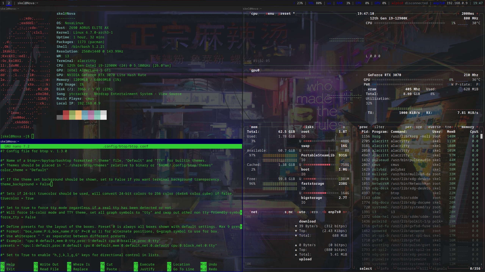

# NovaLinux Dotfiles
This is my desktop's dotfiles for my Arch installation.  
This is not one-size-fits-all.  
You'll probably need to at least edit the i3 config to change the background and remove or change the xrandr command that I needed to run to set my refresh rate correctly.  
You may also want to modify the Polybar config if you don't have an Nvidia GPU since it displays GPU usage using nvidia-smi.  
My i3 config also has some bindcodes, one to use the scrot when pressing the prt sc key and a couple for buttons on my macropad which uses F13-F24 keys.  
I also added a bind for SUPR-Shift-S to use scrot --select.  
The Rofi Theme is Dracula, I don't think I changed much of anything there.  

